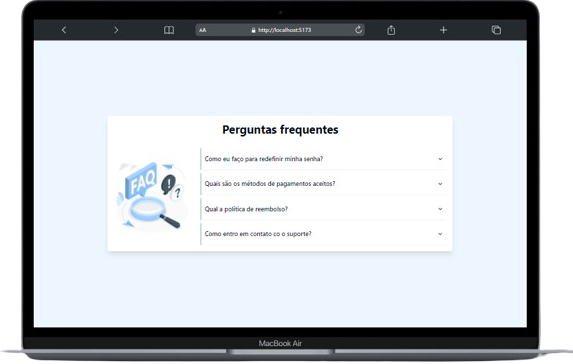

## FAQ Page

Este é um layout de uma página de FAQ desenvolvido com [Vite](). Os frameworks utilizados para o desenvolvimento foram:

- React
- Typescript
- Tailwind CSS
- Shadcn
&nbsp;

## 👨🏻‍💻 Começando...

Primeiro, execute os seguintes comandos no cmd da sua IDE:

```bash
npm install
```

```bash
npm run dev
```

👍🏻 Execute o projeto no navegador com `localhost://5173`

---
## 💻📱 Layouts do projeto

O projeto contém responsividade em suas páginas.

| Desktop | Mobile |
|--|--|
| | |